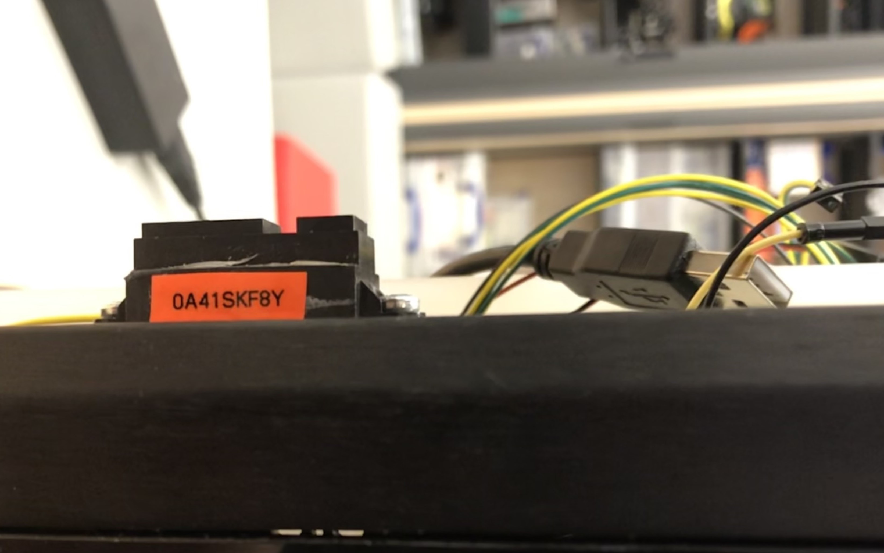

# Rover Documentation

This is the documentation for the York University Rover research platform. It is designed to be an expandable platform for robotics research.
It includes:

- [Raspberry Pi 3B+](#raspberry-pi)
- Xilinx Digilent Zybo Z7
- [YDLidar X4](#lidar)
- High Precision AD HAT
- 5x [IR Sensors](#ir-sensors)
  - 3x Sharp GP2Y0A21YK0F (10-80cm)
  - 2x Sharp GP2Y0A41SK0F (4-30cm)
- [Sabertooth 2x12](#motor-driver)
- 4x DC motors
- 4x motor encoders
- 2x 5 Volt regulators

The code is in Python3 on the Raspberry Pi. <br>
One program to record data from the IR and Lidar to the Pi's SD card, another to plot the Lidar and IR data in real time

## Hardware

The focus of my project was focused on using the Lidar and IR sensors for positional processing. <br>
This left several pieces of hardware unused:

- The FPGA chip, which I disconnected from power
- Pi to FPGA connections (left all but pin 12 and 33 connected)
- Motor encoders (completely detatched)

<br>

### System Overview


As shown in the diagram a (3 cell) lipo battery was used to power the sytem, this was due to issues with the provided UPS. Both the Pi and LIDAR are powered from this via USB cables with stripped ends.

To avoid issues powering both the Lidar and Pi simultanouesly they each have their own a voltage regulator. <br>
One of the regulators (lidar) is connected via the breadboard the other (pi and IR) is connected via red and blue GPIO header cables.


---

### Raspberry Pi

The Raspberry Pi is a model 3B running Raspbian.

The Pi has an HAT which allows it to read the IR sensors.
Most of the GPIO pins on this HAT are connected to the FPGA and are a hold over from an earlier project.
The original FPGA connections are show below


The Pi connected via ground to a common ground shared by all the components.

---

### IR Sensors

The IR sensors are supplied 5V by the same voltage regulator as the Pi via a power rail on the breadboard.


There are 2 different IR sensors on the vehicle.

- [GP2Y0A21YK0F](https://global.sharp/products/device/lineup/data/pdf/datasheet/gp2y0a21yk_e.pdf) (aka 2Y0A21)
- [GP2Y0A41SK0F](https://global.sharp/products/device/lineup/data/pdf/datasheet/gp2y0a41sk_e.pdf) (aka 0A41SK)


Their outputs vary between the input voltage (5V) and about 0.5V, this is passed into the numbered IN screw terminals on the [High Precision AD HAT](https://www.waveshare.com/wiki/High-Precision_AD_HAT) ([Datasheet](https://www.waveshare.com/w/upload/2/2a/Ads1262.pdf))


Whilst most can be identified by the serial number on their cases some have suffered damage so have been labelled.  

2Y0A21 have a range of 10-80cm <br>
0A41SK have a range of  4-30cm





<br><br>
The layout of the IR sensors:<br>


Tip:<br>
The IR connectors are coloured red, black and yellow <br>
Red is **data**, *not* live   <br>
Black is **ground** <br>
Yellow is voltage in

---

### LIDAR

The LIDAR is a [YDLIDAR X4](https://www.ydlidar.com/Public/upload/files/2021-08-20/YDLIDAR%20X4%20Data%20sheet%20V2.0.pdf)

Power is provided by seperate 5V regulator to the Pi and IR sensors. This is to avoid voltage spikes that prevented the Lidar motor from spinning up when it's turned on.

The regulator and lidar are both connected via the breadboards' lowest power rail.


The LIDAR is connected to the Pi via a USB cable.

---

### Motor Driver

The motor driver is a [Sabertooth 2x12](https://www.dimensionengineering.com/datasheets/Sabertooth2x12.pdf)

It is connected to all 4 motors in a tank track configuration


The motor driver is powered via a battery connector that can be found below the breadboards.

Control is handled by the Pi using pwm. <br>
Pins 12 and 33 are passed into a low pass filter described in the sabertooth documentation


The Sabertooth settings are controlled by switches on its board. I set them to:<br>
Analogue input with mixed mode, exponential repsonse and 4x sensivity turned off


Notes:

For some reason a pwm of 80 is stationary, (100 is forward).This means the rover can move much faster backward than forward currently

---

## Software

The software for this project was written in Python 3

The code use <https://github.com/YDLIDAR/YDLidar-SDK> to handle the Lidar and for the HAT some [code](http://www.waveshare.com/w/upload/6/64/High-Pricision_AD_HAT_Code.7z) found on the [waveshare page](https://www.waveshare.com/wiki/High-Precision_AD_HAT) for the HAT (under quick start

Motor control [software](../docs/motor_pwm.py) has been left seperate and minimal

### Lidar

Control of the lidar is done via a Python [API](https://github.com/YDLIDAR/YDLidar-SDK/blob/master/doc/howto/how_to_build_and_install.md#python-api-install-separtately)

It requres `import ydlidar` and then setting the Lidars settings. I found the ones used in this project in the example documentation for the lidar driver


The Lidar is turned on

``` python
     # Lidar data
      laser_on = LASER.turnOn()
      if laser_on:
          laser_scan = LASER.doProcessSimple(LASER_SCAN)
          
```

And if successfully turned on, the data (range and corresponding angle) is written into a list

``` python
if laser_scan:
  l_angle = []
  l_range = []
  for point in LASER_SCAN.points:
      l_angle.append(point.angle)
      l_range.append(point.range)
```

### IR and Hat

The output voltage from the IR senors area read into the High Precision AD HAT on the Pi. These values are read as 32 bit signed integers using the [example code](../docs/IR/config.py) which is imported as `ADS1263`

A reference voltage `IR_REF_VOLTAGE` must be set to the voltage of the power rail. 5.08 Volts this setup

After that the readings can be read from the HAT and converted back into voltages and then converted into distances using the code below 

``` python
# IR Data
ir_distances = []
ir_rads = [0.0 ,pi / 2, pi, (3 * pi) / 2]

adc_vales = ADC.ADS1263_GetAll()

for i in range(SENSORS):
    voltage = adc_vales[i] * IR_REF_VOLTAGE / 0x7fffffff

    ir_dist = 29.988 * pow(voltage, -1.173) / 100
    ir_distances.append(ir_dist)
```

### Recording Code

`data_gather.py` is a bare bones data recording file. When run it saves the raw data from the sensors into a file `data/[user name]/[current data and time]` where [user name] is the first argument passed to the program

The angles of the IR sensors are not save automatically and all the voltages are saved as the 32 bit integers read from the HAT with the reference voltage saved above them