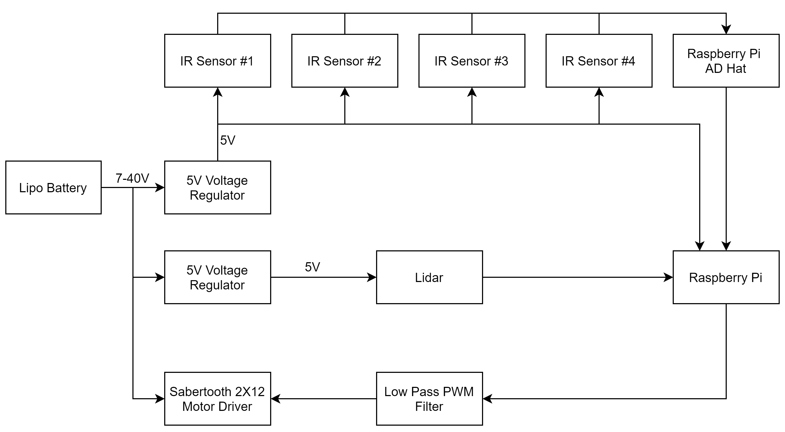

# Rover Documentation

This is the documentation for the York University Rover research platform (my name not theirs). It is designed to be an expandable platform for robotics reaserch.
It includes:

- Raspberry Pi [TODO: check]
- Xilinx Digilent Zybo Z7
- YDLidar X4
- High Precision AD HAT
- 5x IR Sensors [TODO: check]
- Sabertooth 2X12
- 4x DC motors
- 4x motor encoders
- 2x 5 Volt regulators

The code I have written is on the Raspberry Pi and is in Python 3. One program records data from the IR and Lidar to the Pi's SD card for later processing, the other program plots the Lidar and IR data in real time onto a polar graph using Matplotlib.

## Hardware

My project was focused on using the Lidar and IR sensors for positional processing. This left several pieces of hardware unused.
I disconnected the FPGA chip from power but left most of its connections to the Pi as these were set up by a previous student. The motor encoders have also been left completely detatched.

### Raspberry Pi

The Raspberry Pi is a model 3B running Raspbian.
It is powered via the micro usb cable through the breadboard behind the Lidar.
